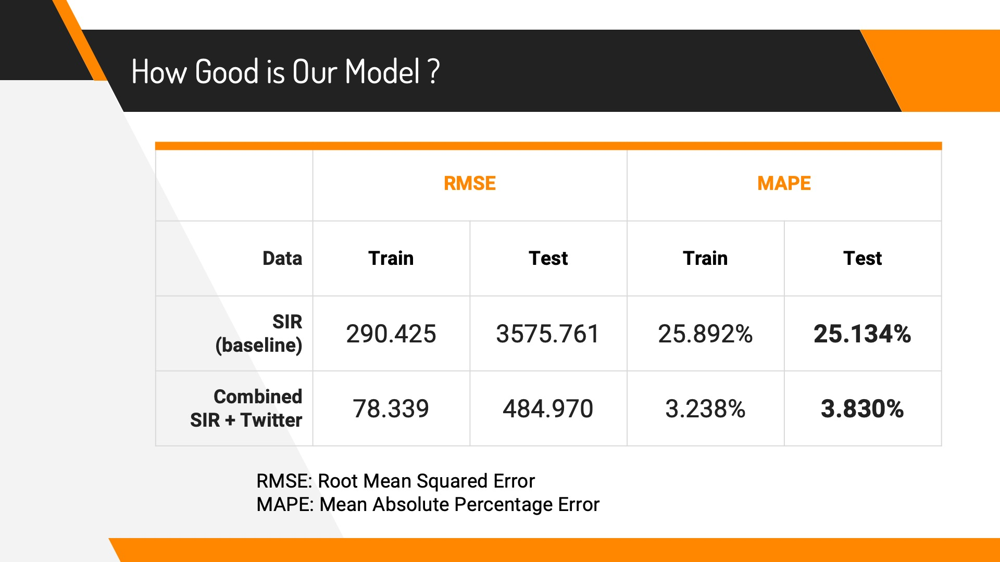
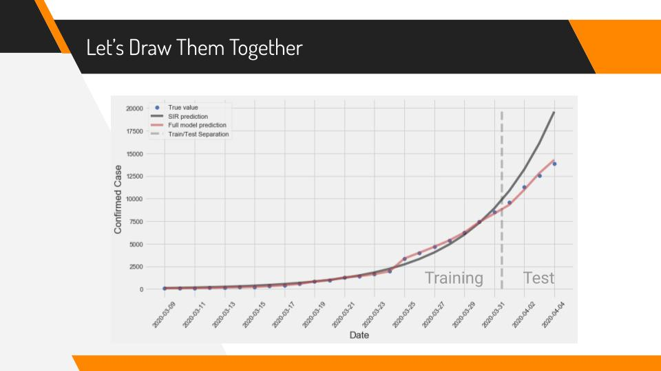

# COVID_19_Prediction

More detailed explanation can be found in [reports/COVID-19_Prediction.pdf](./reports/COVID-19_Prediction.pdf)

## Methodology

We use Twitter data to improve the performance of an epidemiological model like SIR on predicting future covid-19 infection cases. More specically, we generate a SIR curve using LSE and find 20 unigrams and bigrams in Tweets whose document frequency are most highly correlated with the daily infection rate (number of new confirmed cases). We input these as features to a Linear Regression model, applying regularization, to predict the number of confirmed cases within the next 4 days.

## Data

COVID-19 data are found from [www.canada.ca](https://www.canada.ca/en/public-health/services/diseases/2019-novel-coronavirus-infection.html). This data set includes all informations to generate the SIR curve.

Tweets are downloaded from [kaggle](https://www.kaggle.com/smid80/coronavirus-covid19-tweets). This data set contains all Tweets that are tagged as COVID19 (or its synonyms), including non English ones. Hence, preprocessing is needed. Because this data set is very large (~40M records), it is processed in a distributed environment using Spark.

## Result

We use data in March to train the model and the first 4 days in April to evaluate its predictive performance. The predictive power of our model is much better than the baseline model (using SIR only)
.

