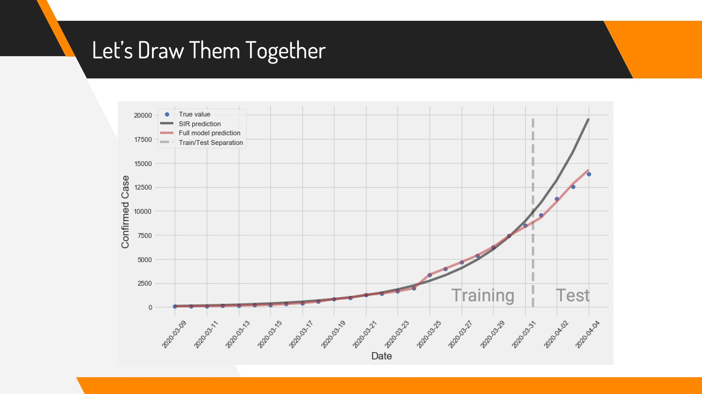

# COVID_19_Prediction

More detailed explanation can be found in [reports/COVID-19_Prediction.pdf](./reports/COVID-19_Prediction.pdf)

## Idea

Models like SIR are good at explaining the general trend of an epidemic like COVID 19. However, due to its small degree of freedom, these models has limited power when capturing smaller fluctuations from the curve and therefore is not good at prediction in short-term. Our hypothesis is that these smaller fluctuations are usually caused by people's reactions to the News and Social Media. Therefore, we combine these extra information from the News and Social Media together with SIR model to construct a model with better predictive power.

## Methodology

We first generate the SIR curve using Least Squared Estimate, and consider it as the baseline. We then collect unigrams and bigrams from COVID 19 related Tweets and count their frequency at a daily level. After that, we rank the keywords by their absolute correlation to the derative of the cumulative cases curve. Finally, we use the baseline curve and the top 20 keywords' daily trend as explanatory variables of a Linear Regression, number of confirmed case (leading 4 days) as the response variable, using L2 regularization to avoid overfitting. Note that the problem of autocorrelation is elimiated because the SIR curve itself is a non-linear time series function.

## Data

COVID-19 data are found from [www.canada.ca](https://www.canada.ca/en/public-health/services/diseases/2019-novel-coronavirus-infection.html). This data set includes all informations to generate the SIR curve.

Tweets are downloaded from [kaggle](https://www.kaggle.com/smid80/coronavirus-covid19-tweets). This data set contains all Tweets that are tagged as COVID19 (or its synonyms), including non English ones. Hence, preprocessing is needed. Because this data set is very large (~40M records), it is processed in a distributed environment using Spark.

## Result

We use data in March to train the model and the first 4 days in April to evaluate its predictive performance. The predictive power of our model is much better than the baseline model (using SIR only)
  

